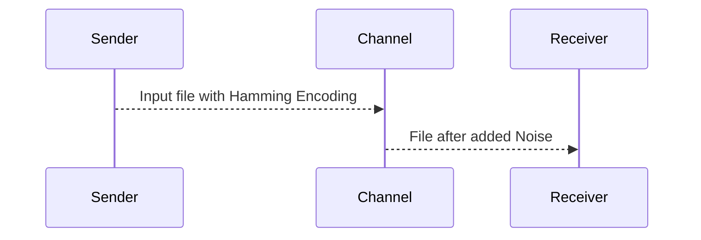

# Noisy Channel 
Developed by:
* Shachar Cohen (313416521) 
* Yuval Naor (312497084) 

This project is an implementation of a noisy communication-channel.
The projects consists two clients: a sender and a receiver, and a server that acts as the noisy communication channel.

The system allows you to send files (which their size is a multiplication of 26 Bytes) through the noisy channel, and using Hamming Code to decode and clean the noise added to the files.

## Credits
This project is using mainly Winsock2 library by Microsoft.
You can find in the code comments  references and gratitude for personals which helped with implementing some logics.

## Running instructions:

This manual will instruct you on how to to get both clients and server running to allow you send files from the Sender to the Receiver through the Channel.

### Channel

Running template: 
>**Channel.exe -flag [argument 1] [argument 2 ]**

* Currently there are two flags supported by the channel: 
### -r
allows to add random noise to the transferred file.
	   [argument 1] = random seed
	   [argument 2] = probability (in 1/2^16 scale)
####	**Example**:
	> Channel.exe -r 232 34853
### -d
allows to add deterministic noise to the transferred file, with given cycle
	   [argument 1] = Cycle
####	**Example**:
	> Channel.exe -d 112

After channel is up and running, it will output the connection details for the Client and sender:

 >Sender socket: IP address = 10.100.102.13 port = 54247
Receiver socket: IP address = 10.100.102.13 port = 54248

The IP address given by the Channel output is the ip address of the current host running Channel.exe

### Sender

will get an input the Ip address and port to connect to the Channel:
>Sender.exe [ip_address] [port ]

####	**Example**:
	> Sender.exe 10.100.102.13 54247

After the Sender has connected to the server, it will ask for an input file path: This is the file which will be sent.

### Receiver
will get an input the Ip address and port to connect to the Channel:
>Sender.exe [ip_address] [port ]

####	**Example**:
	> Sender.exe 10.100.102.13 54248

After the Receiver has connected to the server, it will ask for an output file path: this is the file that will be written by the Receiver after decoding.

## Overall System Structure

The system acts like a classic Sever-Client interface with one server and two clients:

- The server is listening in two sockets for incoming connections: one from the sender and another from the receiver.
- After connection is established, the server uses two different sockets to send/receive data.

Each component in the project is a stand-alone application and can be compiled and run independently from the other components.
 
## Restrictions
1. The system supports only files which their size is a multiplication of 26 Bytes: this is due to the implementation of (31,26,3) Hamming Code.
2. File size to transfer is limited to 100kB
3. The Channel (Server) has timeout for listening sockets. if the server is ran and waiting for too long: those sockets will be closed and the server will have to be re-ran.